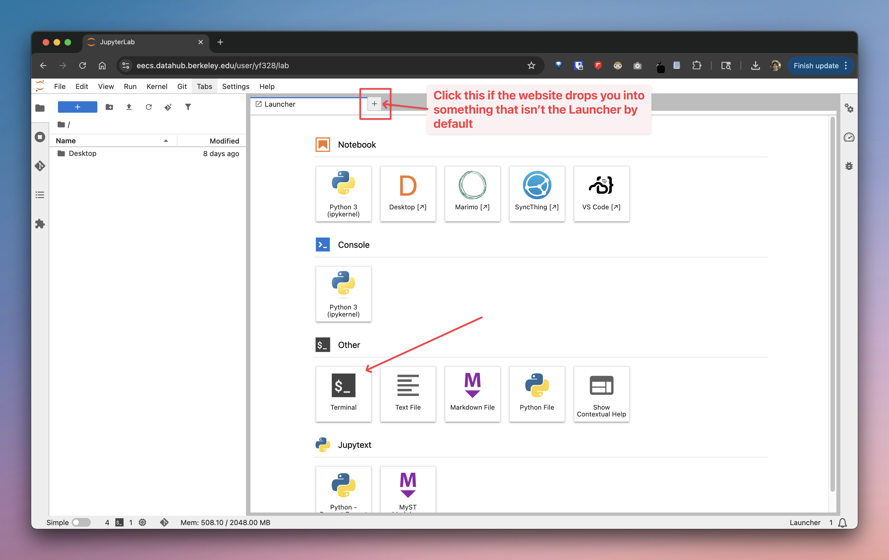

# EE194 Lab 0 -- Chisel Lab
Lab 0: Chisel Lab for UC Berkeley's EE[194](https://www2.eecs.berkeley.edu/Courses/EE194/)/[290-7](https://www2.eecs.berkeley.edu/Courses/EE290/): IC Design Project: 16nm SoC for IoT in Jupyter Notebooks. 

## Setup for Berkeley Students
* Go enroll in the GitHub Classroom, grab the URL to your provisioned GitHub repository for this lab.
* Sign in to https://eecs.datahub.berkeley.edu/
* On the Launch page (if you don't see this, click the "+" button on the top tabs bar), Click "Terminal". If you don't see the bar at the top, you might need to exit "Simple" mode using the dial at the bottom left of your window.

* Once this terminal launches, you can treat this just like any normal remote machine. You then should go setup your SSH key and Git so that you can clone a private repository on this machine. You can double-check you did things correctly with `ssh -T git@github.com`, it should display a string with your GitHub username. We expect you to know how to do this already coming into this class.
    * If you find yourself having trouble with this, please consider brushing up on your foundational Unix and git knowledge. They are **essential** for this class. Additionally, double-check you have taken the prerequisites for this class as this was covered in the first lab of both CS61C and EECS151, at minimum.
    * Resources that can get you unblocked for now: [here](https://docs.github.com/en/authentication/connecting-to-github-with-ssh/generating-a-new-ssh-key-and-adding-it-to-the-ssh-agent) & [here](https://docs.github.com/en/authentication/connecting-to-github-with-ssh/adding-a-new-ssh-key-to-your-github-account).

* Clone your own GitHub repository that was provisioned for you by GitHub Classroom into your home folder (`~/`) on this machine.
* Once cloned, `cd` into the lab folder, run `chmod +x bInstall.sh`, then `./bInstall.sh`. This installs the Scala kernel onto your Jupyter Notebook instance.
* After installation, open **part1/part1.ipynb** (NOT **part0/part0.ipynb**) to get started! 
* Push your changes as you go via the Terminal.

### Submission Instructions for Berkeley Students
* Push to your provisioned repository on GitHub Classroom by the lab due date. We will use your latest commit before (or at) the submission deadline as your final submission.

## Setup for Non-Berkeley Students
The binder link is available here: https://mybinder.org/v2/gh/ucb-ee194-tapeout/chisel-labs/HEAD
* Binder will discard any work after 10 minutes of idle time, for prolonged work, we highly suggest you [setup locally](#local-installation).

## Local Installation
- To avoid [Binder's](#setup-for-non-berkeley-students) limitation of discarding work after 10 minutes of idle time, you can set up a local development environment.
- For local development the install script will install JupyterLab to a virtual environment assuming python3 is available and will install the Scala kernel 'Almond'.
- To run the script run via commandline: `./install.sh`.
- Activate the environment via `source chisel_nb_env/bin/activate`.
- Start Jupyter Notebook via `jupyter notebook` then navigate to the provided url in your browser.
- Use the file browser to navigate to the lab.

## Acknowledgements
* `resource/chisel_deps.sc` and `binder` configs are borrowed from the Chisel bootcamp: https://github.com/freechipsproject/chisel-bootcamp
* This series of labs is adapted from [Scott Beamer](https://scottbeamer.net/)’s [CSE 228A - Agile Hardware Design](https://github.com/agile-hw) lecture demos + labs, with inspiration from the [FreeChipsProject Chisel bootcamp](https://github.com/freechipsproject/chisel-bootcamp).
